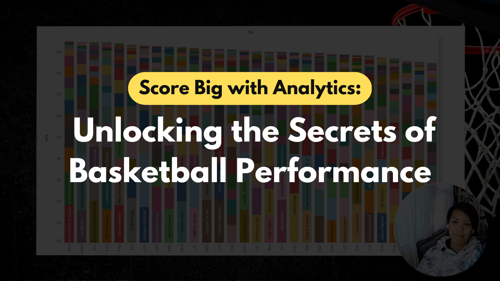

# Welcome to My Portfolio

---

## Learn About My Projects
<!--
#### [Internal Blog Post Project](/bank)

Tolulope is the best

---
#### [Linked File Project](/files/Day 12 - 21 days to data.pdf)

For this project, I explored what a good analytics PowerPoint presentation should entail. It talks about main talking points, how to tie data to the business value, and much more.

----->
## [The Power of Visualization: Exploring the Most Popular Champions on League of Legends](https://www.linkedin.com/pulse/power-visualization-exploring-most-popular-champions-cherie/)

I recently used Tableau and SQL to analyze data from competitive games in League of Legends, and the results were fascinating. By visualizing the most popular champions by position, I gained a clearer understanding of player preferences and strategies. In addition, using SQL allowed me to create a data frame and visualize the player with the most kills during a specific time frame. I found that Bang had the highest number of kills from 2015-2018, and his most used champions varied based on the team he was playing against. These insights can be incredibly valuable for players and teams looking to improve their gameplay and increase their chances of winning. Check out my article to learn more about the power of data analysis in competitive gaming! #Tableau #SQL #DataAnalysis #LeagueOfLegends #GamingInsights

#### Tools Used
- Deepnote
- SQL
- Tableau
- [Data Set from Kaggle: League of Legends](https://www.kaggle.com/datasets/chuckephron/leagueoflegends)

---
## [Data Mining with Python: Uncovering Insights on Iron and Silica Concentration](https://www.linkedin.com/pulse/data-mining-python-uncovering-insights-iron-silica-pavico-tsukayama)

I'm excited to share my latest article on data analytics! In this article, I delve into the world of iron ore mining and showcase how I used Python, Seaborn, Pandas, and Matplotlib to analyze data on Iron and Silica concentrate in a flotation plant. The goal of the project was to take a look at monthly production of Iron concentrate and Silica concentrate. If you're interested in learning more about how I used python to analyze this data, give my article a read!

#### Tools Used
- Deepnote
- Python
- Seaborn
- Pandas
- Matplotlib
- [Data Set from Quality Prediction in a Mining Process](https://www.kaggle.com/datasets/edumagalhaes/quality-prediction-in-a-mining-process?resource=download)

---
## [Score Big with Analytics: Unlocking the Secrets of Basketball Performance](https://www.linkedin.com/pulse/score-big-analytics-unlocking-secrets-basketball-pavico-tsukayama-1c)

I completed my Sports Data Analytics project, which was so fascinating to me. I don't know much about basketball but by doing this analysis I learned great insights into the positions and players.

I decided to present my findings via video to practice my presenting skills more. It's something I'm comfortable with and have done on other projects for my current position.

**These are the key points that I use this data set for.**
1. How players did on total points, total assists, & total rebounds by position
1. Create a reference sheet for where the best 3-point shooters are for each team.
1. What were the total points scored by each team and how each player contributed to the total points?
1. Show the assists made by each position.

#### Tools Used
- Tableau
- Tableau Stories
- [Data Set from basketball-reference.com](https://www.basketball-reference.com/leagues/NBA_2022_totals.html)

---
## [Patient Profiles: Understanding Who's Coming Through the Doors](https://www.linkedin.com/pulse/patient-profiles-understanding-whos-coming-through-pavico-tsukayama/)

It was fun to delve deeper into the use of SQL clauses, keywords, and methods. I utilized two tables in the data set to obtain the results I was looking for. In this article, I'll share my experience and show you how I used SQL to get the information I needed.

The specific terms that will be covered in this article are
- Histogram
- HAVING
- JOIN
- CASE WHEN
- UNION

#### Tools Used
- SQL
- SQL Workbench
- [UCI Machine Learning Repository](https://archive.ics.uci.edu/ml/datasets/Diabetes+130-US+hospitals+for+years+1999-2008#)

---
## [Unlocking Insights from Historical IDA Credit and Grant Data with SQL and bit.io](https://www.linkedin.com/pulse/unlocking-insights-from-historical-ida-credit-grant-pavico-tsukayama/)

By using the historical dataset provided by The World Bank and using SQL I was able gain the below insights.

- There are a total of **1,119,992** transactions in this dataset.
- The most that was owed to IDA was **$793,256,127.64**.
- The most recent payer was **"Ministry of Finance"** on **12/21/2014.**
- **"Ministry of Finance"** took out the most number of loans.

#### Tools Used
- SQL
- [bit.io](https://bit.io/https://bit.io/)
- [The World Bank Data Set](https://finances.worldbank.org/Loans-and-Credits/IDA-Statement-Of-Credits-and-Grants-Historical-Dat/tdwh-3krx)

---

## [From Pennies to Plenty: A Data-Driven Study of DoorDash Spend](https://www.linkedin.com/pulse/from-pennies-plenty-data-driven-study-doordash-spend-cherie/)

Marketing Analytics Project on DoorDash spend where I share how I found these results.  
- There is a 67% relationship between people's incomes and their spending habits
- 54% of customers spent between $4.00 - $418.00.
- Those who are most likely to spend between $4.00 - $418.00 earn between $29.7k and $43.7k.

#### Tools Used
- iFood Dataset from Kaggle provided by Avery Smith's Data Analytics Accelorator
- Excel
- Pivot Tables
- Aggregate functions
- Historgram Chart with bins
- Scatter Plot with Trendline & R2

---

## [Visualizing The Achievement Gap: A Tableau Project Highlighting Graduation Analytics in Massachusetts Education](/tableauMaSchoolProject.md)

Education Analysis Project built in Tableau Public for personal and professional knowledge.

#### Tools Used
- Massachusetts Education Dataset provided by Avery Smith's Data Analytics Accelorator
- Tableau Public
- Scatter Plot
- Area Chart
- Tableau Dashboard
- Threshold Line
- Color Gradients

<!--
---
#### [Education Project](https://www.linkedin.com/pulse/massachusetts-education-analysis-samantha-paul/)

In this case study from Data Analytics Accelerator, I was prompted to analyze the State of Massachusetts education data. The main focuses were:
What schools are struggling the most?
How does class size affect college admission?
What are the top math schools in the state?

---

### Category Name 2

- [Project 1 Title](http://example.com/)
- [Project 2 Title](http://example.com/)
- [Project 3 Title](http://example.com/)
- [Project 4 Title](http://example.com/)
- [Project 5 Title](http://example.com/)

---
-->
