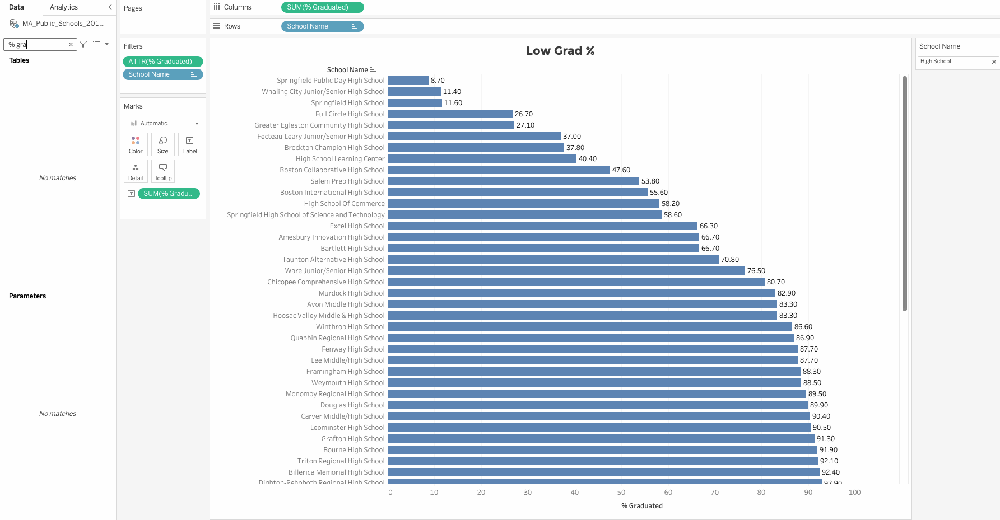
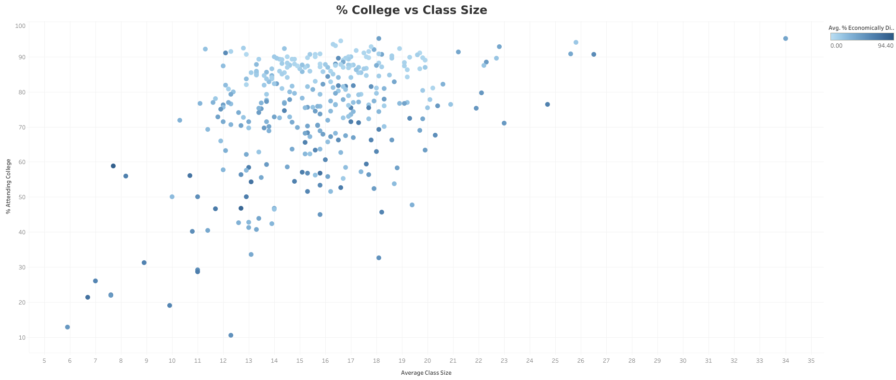
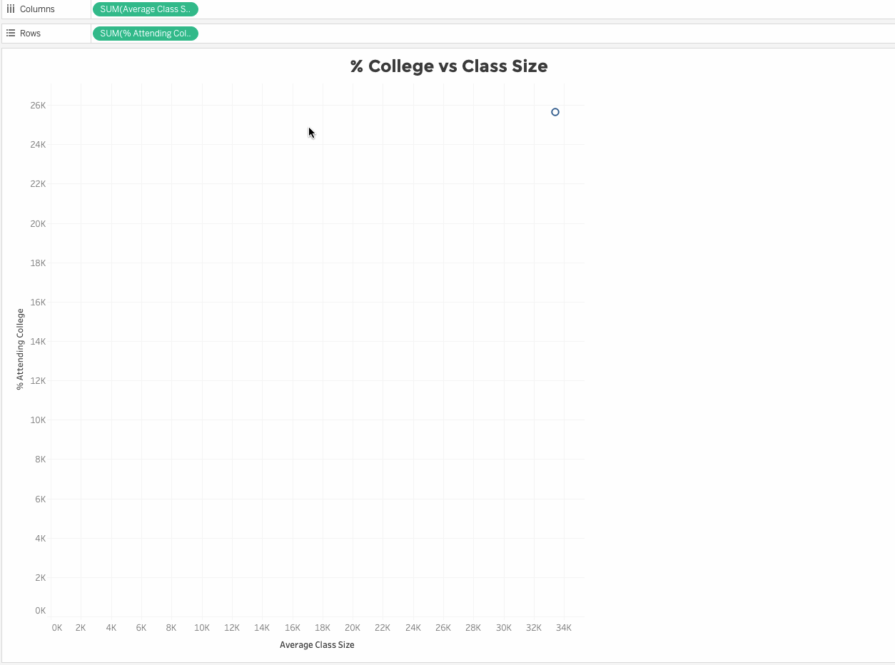
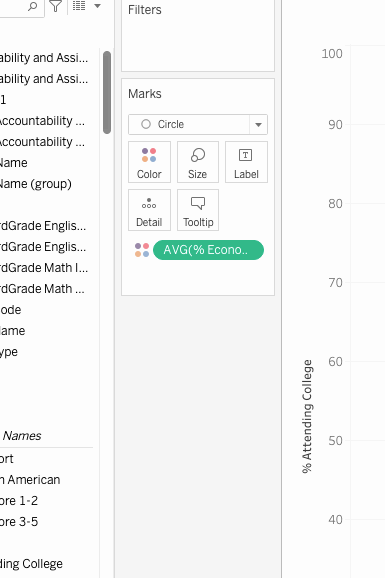
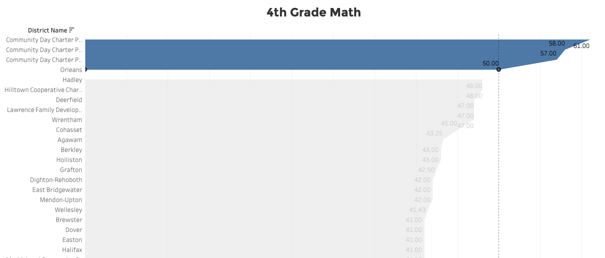
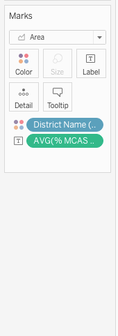
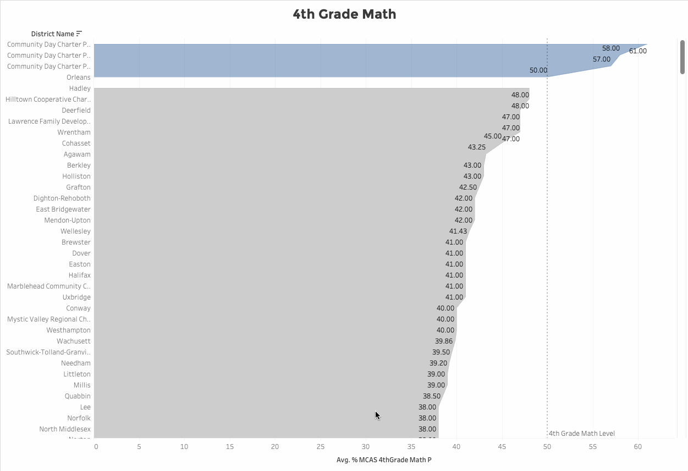

This project was part of my exploration into Tableau Public for personal and professional knowledge. It has solidified my understanding of elements on a dashboard and introduced me to Tableau Public basics. I am already using concepts that I have learned about dashboards at work, so this was a great project.

I analyzed the Massachusetts Education Dataset to find if building more schools in the area would lead to more high school students attending college.

### Here are my findings:
* **12 to 19** - Class size average leads to more students attending college.
* **💵 VS 💸💸💸** - The economically advantaged students were more likely to graduate and attend college.
* **10 Highschools** - Below are 10 high schools that would benefit from the smaller class size
    1. Springfield Public Day High School
    1. Whaling City Junior/Senior High School
    1. Springfield High School
    1. Full Circle High School
    1. Grate Egleston Community High School
    1. Fecteau-Leary Junior/Senior High School
    1. Brockton Champion High School
    1. High School Learning Center
    1. Boston Collaborative High School
    1. Salem Prep High School
* **4th Grade Math** - These are the top 3 districts that had 50% of their students pass 4th Grade Math.
    1. Community Day Charter Public School - R. Kingman Webster (District)
    1. Community Day Charter Public School - Prospect (District)
    1. Community Day Charter Public School - Gateway (District)
 

## Overall Thoughts on Tableau Public
It’s a powerful tool with a small learning curve, but nothing that can’t be googled and found in their documentation. I’m looking forward to how to connect a database to Tableau and am excited to work with more dashboards!

Below are some of the things that I learned during this project. If you enjoyed my dashboard or found my tips below helpful please give this article a like, share it, bookmark it for future use, or leave a comment. Thanks so much!  

# Tableau How To’s & Big Take Aways; TL;DR 
## Tableau Key Terms

### <u>Data Pane</u>
- Located on the far left side of the Tableau window. This is where each column is available for use. Each item in the data pane can be dragged and dropped into Cards and Shelves

### <u>Cards</u>
- The column of blocks next to the Data Pane. Pages, Filters, Marks (marks contain shelves)

### <u>Shelves</u>
- The “Columns”, Rows, Color, Size, Label, Detail, and Tooltip. Drag items from the Data Pane to these Shelves to create your stand-alone visualization

### <u>Y-Axis</u>
- This is the dependent variable.

### <u>X-Axis</u>
- This is the independent variable.

### <u>Legend</u>
- To display Legend go to Analysis in the menu and look for “Legend”.

### <u>Gradient Coloring</u>
Add an item to the “Color” Shelf on the Marks card, select “Continuous”, then change the color on the Legend on the top right.

## <u>Scatter Plot</u>
A scatter plot helps to visualize data quickly to see where there could be a relationship. In the scatter plot below I emphasized where the plots were most condensed and I was able to conclude that class sizes that have 12 - 19 students in them have better graduation percentages

I also used color to use the data point of % Economically Disadvantaged. By adding a color gradient to the plots I was able to share this insight in the same scatter plot.

I like this scatter plot because it is a dual-purpose chart and is simple and easy to make decisions on. This would be a great way to illustrate if the state should build more schools to reduce class size to improve graduation percentages.

## <u>Scatter Plot Learnings</u>
- Tableau will always aggregate the data.

### <u>Unaggregated Data</u>
- Right-click the item on the shelf > Dimension. This will break up the data on the scatter plot to not be connected by lines.

### <u>Change the visualization to plot points</u>
- On the Marks Card use the drop-down and select “Circle”

## <u>Area Chart Learnings</u>
An area chart with groupings can be visually informative giving weight to the chart versus just a line chart. In this instance, it gives a better visual for this data.

### <u>Marks Card Automatic Shelf Dropdown</u>
- You’ll want to use the dropdown on the Marks card and select “Area”

### <u>Reference Line</u>
This line is to show the data Threshold. 
- Right-click on the X-axis > Add Reference Line > Value > Create New Parameter > Name: Name your Parameter > set Current Value {desired number} > Ok.

 

 ### <u>Grouping Points</u>
This is useful to emphasize data separations. 
- Drag select on the graph the points you want to group > hover over selected points > click on the icon that looks like a paper clip.

 

If you enjoyed this article, found it helpful, or have any comments please share them with me in the comments below! Thank you so much!
