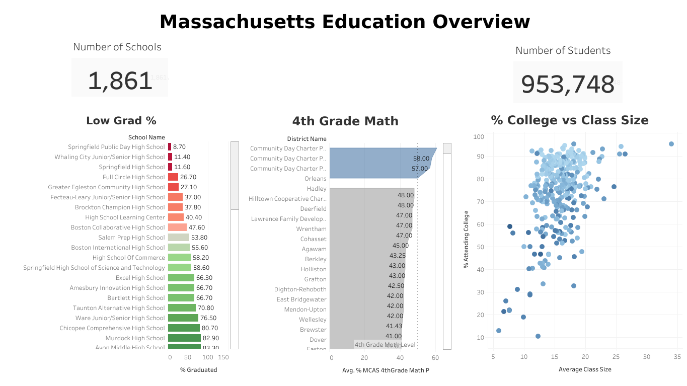
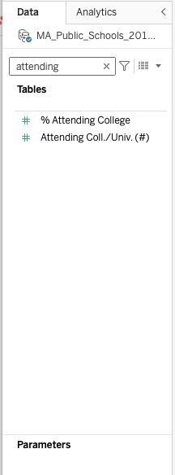
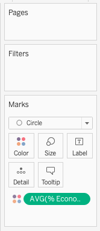
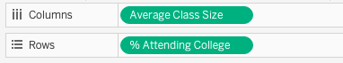

This project was part of my exploration into Tableau Public for personal and professional knowledge. It has solidified my understanding of elements on a dashboard and introduced me to Tableau Public basics. I am already using concepts that I have learned about dashboards at work, so this was a great project.

I analyzed the Massachusetts Education Dataset to find if building more schools in the area would lead to more high school students attending college.

### Here are my findings:
* **12 to 19** - Class size average leads to more students attending college.
* **💵 VS 💸💸💸** - The economically advantaged students were more likely to graduate and attend college.
* **10 Highschools** - Below are 10 high schools that would benefit from the smaller class size
    1. Springfield Public Day High School
    1. Whaling City Junior/Senior High School
    1. Springfield High School
    1. Full Circle High School
    1. Grate Egleston Community High School
    1. Fecteau-Leary Junior/Senior High School
    1. Brockton Champion High School
    1. High School Learning Center
    1. Boston Collaborative High School
    1. Salem Prep High School
* **4th Grade Math** - These are the top 3 districts that had 50% of their students pass 4th Grade Math.
    1. Community Day Charter Public School - R. Kingman Webster (District)
    1. Community Day Charter Public School - Prospect (District)
    1. Community Day Charter Public School - Gateway (District)
 

## Overall Thoughts on Tableau Public
It’s a powerful tool with a small learning curve, but nothing that can’t be googled and found in their documentation. I’m looking forward to how to connect a database to Tableau and am excited to work with more dashboards!

Below are some of the things that I learned during this project. If you enjoyed my dashboard or found my tips below helpful please give this article a like, share it, bookmark it for future use, or leave a comment. Thanks so much!  

# Tableau How To’s & Big Take Aways; TL;DR 
## Tableau Key Terms
|  |  |  |
| :---         |     :---      |          :---: |
|**Data Pane** | Located on the far left side of the Tableau window.  This is where each column is available for use.  Each item in the data pane can be dragged and  dropped into Cards and Shelves     | |
|**Cards**|The column of blocks next to the Data Pane.  Pages, Filters, Marks (marks contain shelves)||
|**Shelves**|The “Columns”, Rows, Color, Size, Label, Detail, and Tooltip.  Drag items from the Data Pane to these Shelves  to create your stand-alone visualization.||
|**Y-Axis**|This is the dependent variable.||
|**X-Axis**|This is the independent variable.||
|**Gradient Coloring**| Add an item to the “Color” Shelf on the Marks card,  select “Continuous”, then change the color on the  Legend on the top right.

